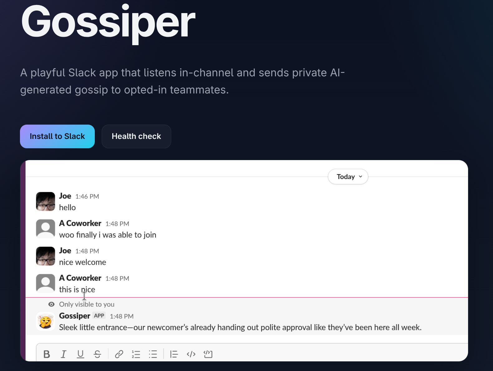

I built a Slack app called [**Gossiper**](https://gossiper.company/). It listens to messages in a channel and sends private AI-generated commentary back to opted-in people.

The important part is that it does not post publicly.

Most Slack apps try to become visible participants. They post updates, summaries, alerts, and reactions into the channel. Sometimes that is useful. It is also how apps make Slack feel crowded.

What interested me was a Slack primitive that already exists: the message that appears in channel context but is marked `only visible to you`.

## How it works

When someone posts in a whitelisted Slack channel, Gossiper sends you a private comment that only you can see.

Say someone in `#general` posts: *"Just survived a 2-hour meeting that could have been an email."* Gossiper might slide you a private message in that same channel context: *"Bold of them to say out loud what everyone was thinking."* Only you see it. The channel stays clean.

Not a public reply. Not a thread. Not a DM that pulls you out of the room.

You install it into a workspace, invite it to channels, and turn it on where you want it. Two slash commands:

- `/gossip-channel` whitelists the current channel for gossip
- `/gossip-me` opts you in to receive gossip

Both can be turned off. A joke app stops being funny if it feels like it is happening to people instead of for them.

Under the hood: the app listens passively, generates commentary, and sends it back ephemerally. Each workspace gets its own OAuth install and bot token. State lives in Turso. The app runs as Bun-based Vercel functions.

## Why ephemerality matters

Gossiper would not be as fun if it posted publicly. A bot that comments out loud on every message becomes the main character. Even good jokes get old when they are broadcast into the room.

Ephemeral delivery makes the commentary disposable by default. It can be sharper, stranger, more unserious, because it is not trying to become part of the permanent group record. It shows up, makes its comment, and disappears.

That also makes the AI part feel right. I was not building an authoritative assistant. I was building a tiny private peanut gallery. The job is to be amusing and observant, not correct.

The constraints are the product: only certain channels, only opted-in people, only private messages. Gossiper works because it is small and boxed in.

---

If you want to try it, Gossiper is here: [https://gossiper.company/](https://gossiper.company/). The code is here: [https://github.com/jhsu/gossiper](https://github.com/jhsu/gossiper).